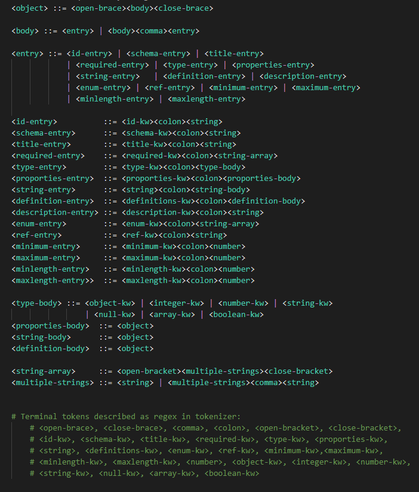

# Json schema validator

Json schema validator is a program to check if given json-schema file as argument has correct structure.

## Prerequisites

Java 11 installed

## Usage

```bash
java -jar json-schema-validator.jar <path-to-file>
```

Example:

```bash
java -jar json-schema-validator.jar example_json_schema.json
```

# About
Program is composed of tokenizer and parser. Tokenizer is seralizng keywords from text to list of tokens and then parser is parsing them in order to check if file has correct gramatic structure.


**_NOTE:_** Not all json-schema keywords are supported!

---
## Tokenizer

Tokenizer tokenizes text using regex mentioned below (regex is java string so it is unescaped):

```java
public enum TokenType {
    
    ID_KW("\"\\$id\""),
    SCHEMA_KW("\"\\$schema\""),
    REF_KW("\"\\$ref\""),
    TITLE_KW("\"title\""),
    REQUIRED_KW("\"required\""),
    TYPE_KW("\"type\""),
    OBJECT_KW("\"object\""),
    INTEGER_KW("\"integer\""),
    NUMBER_KW("\"number\""),
    STRING_KW("\"string\""),
    NULL_KW("\"null\""),
    ARRAY_KW("\"array\""),
    BOOLEAN_KW("\"boolean\""),
    PROPERTIES_KW("\"properties\""),
    DESCRIPTION_KW("\"description\""),
    MINIMUM_KW("\"minimum\""),
    MAXIMUM_KW("\"maximum\""),
    MIN_LENGTH_KW("\"minLength\""),
    MAX_LENGTH_KW("\"maxLength\""),
    ENUM_KW("\"enum\""),
    DEFINITIONS_KW("\"definitions\""),
    OPEN_BRACE("\\{"),
    CLOSE_BRACE("\\}"),
    COLON("\\:"),
    OPEN_BRACKET("\\["),
    CLOSE_BRACKET("\\]"),
    COMMA("\\,"),
    STRING("\"([^\"\\\\\\\\]*|\\\\\\\\[\"\\\\\\\\bfnrt\\/]|\\\\\\\\u[0-9a-f]{4})*\""),
    NUMBER("-?(?:0|[1-9]\\d*)(?:\\.\\d+)?(?:[eE][+-]?\\d+)?"),
    WHITE_SIGN("\\s+");

    private String regex;

    TokenType(String regex) {
        this.regex = regex;
    }

    public String getRegex() {
        return regex;
    }
}
```

If tokenizer won't recognize given text, the program will inform us about it with error:
```
Unrecognized symbol: <symbol> at line <line> (with escaped: <symbol with escaped>)
```

Example:
```
Unrecognized symbol: a at line 29 (with escaped: a)
```
----
## Parser 

Parser parses list of tokens using BNF grammar attached below:



If parser won't recognize gramatic structure of file, the program will inform us about it with error:

```
Cannot parse expression: <expression> at line <line> (line with escaped: <whole line with escaped symbols>)
```

Example:
```
Cannot parse expression: "," at line 27 (line with escaped: \"},,\")
```
**_NOTE:_** This error can be sometimes not fully accurate. 